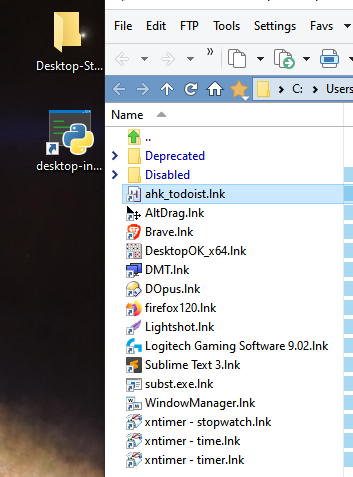

# Process-Delta (psdelta)

**psdelta** is a cross-platform tool for capturing snapshots of running processes and services, comparing them to find differences (a "delta"), and performing actions based on that delta. It can function like an automated “startup” folder—launching specific processes or services when you need them—or like a “shutdown” tool for quickly terminating unwanted processes and services to free up resources. 


## Features

- **Snapshot Creation**: Capture snapshots of running processes and services at any point in time.
- **Delta Comparison**: Compare snapshots to identify which processes/services started or stopped.
- **Automated Actions**: 
  - **Close**: Stop specified processes and services.
  - **Run**: Launch or start processes/services not currently running.
  - **Restart**: Restart processes and services that have changed.
  - **Revert**: Invert the actions for scenarios where you want to undo changes.
- **Dependency Handling**: On Windows, service dependencies are resolved to ensure a correct stop/start order.
- **Include/Exclude Filters**: Narrow down actions to specific processes/services.
- **Delay and Confirm**: Wait between actions and optionally prompt for user confirmation.
- **Fallback Execution**: Automatically attempts fallback options for failed executions.
- **Skip Cmdline**: Optionally skips command-line arguments when launching processes.
- **Once-Only Execution**: Ensures processes are launched only if not already running.

## Typical Use Cases

1. **Startup Optimization**  
   - Automate launching specific services (e.g., VPN service, database server, or custom app) after system boot, mimicking an enhanced “startup folder.”

2. **Gaming or High-Performance Environments**  
   - Shut down unneeded processes and services to free up resources before playing a resource-intensive game.
   - Quickly revert these changes afterward to restore a normal working environment.

3. **Testing and Development**  
   - Maintain different snapshots for testing environments.  
   - Quickly start or close test-related services, daemons, or processes.

4. **Revert Unwanted Changes**  
   - If new software or changes introduced unnecessary processes/services, revert to a stable state by loading a previous delta that stops or uninstalls them.

## Installation

#### **Option 1: Direct / Download**  

```bash
git clone https://github.com/dustinjd/process-delta.git
cd process-delta
```

**Install Dependencies**

- **psutil**: Cross-platform process and system utilities.
- **pywin32** (Windows-only): Required for Windows service management.
```bash
pip install psutil pywin32
```

#### Option 2: pip install

   This installs psdelta.py into your Python environment:

```
pip install git+https://github.com/djdarcy/process-delta.git
```

Or if you want to install it locally in editable mode for debugging:

```
pip install -e .
```

#### Option 3: Symlink

Alternatively, symlink `psdelta.py` into `/usr/local/bin` (on macOS/Linux):

```
pip install git+https://github.com/djdarcy/process-delta.git
```

Then invoke `psdelta` from anywhere.

## Usage Examples
   ```bash
   python psdelta.py [command] [options]
   ```

##### Command Reference Table

Below is a table listing all commands and their functions:

| Command               | Description                                                  |
| --------------------- | ------------------------------------------------------------ |
| `save`                | Captures a snapshot of running processes and services.       |
| `compare`             | Compares two snapshots to generate a delta.                  |
| `load`                | Loads a delta and performs actions (e.g., `close`, `run`, `revert`). |
| `delta`               | Combines snapshot creation and comparison into a single step. |
| `--include <pattern>` | Filters actions to include only processes/services matching the pattern. |
| `--exclude <pattern>` | Filters actions to exclude processes/services matching the pattern. |
| `--confirm`           | Prompts for confirmation before executing each action.       |
| `--revert`            | Inverts the meaning of the delta (e.g., starts processes that were stopped). |
| `-d <ms>`             | Specifies a delay (in milliseconds) between actions.         |
| `--fallback-exe`      | Enables fallback to exe-only if cmdline fails.               |
| `--no-fallback-exe`   | Disables fallback to exe-only.                               |
| `--skip-cmdline`      | Runs the exe without arguments (skips cmdline).              |
| `--once-only`         | Ensures processes are only launched if not already running.  |

### Example Workflows

#### Create a Delta

Capture the initial snapshot, make changes (e.g., start services you want for a gaming session), then create the modified snapshot and delta:

```
# Capture the initial snapshot
psdelta.py save -o initial_snapshot.json

# Make your changes (start or stop processes/services manually)

# Capture the modified snapshot
psdelta.py save -o modified_snapshot.json

# Compare and produce a delta
psdelta.py compare -s1 initial_snapshot.json -s2 modified_snapshot.json -o delta.json
```

This can also be condensed into a single line:

```
# Simplified command to create a delta

psdelta.py delta --wait --save-initial startup_snapshot.json --save-modified startup_optimized_snapshot.json -o startup_optimization_delta.json
```

#### Load a Delta and Close Processes

```
psdelta.py load -i delta.json -a close -d 2000
```

- **-a close**: Close processes/services identified in the delta.
- **-d 2000**: Delay 2 seconds between actions.

#### Automatically Start Services (Reverting a Delta)

```
psdelta.py load -i delta.json -a run --revert --include "ExpressVPN*"
```

- Runs previously stopped “ExpressVPN” processes/services.

```
psdelta.py load -a run -d 2000 -i startup_optimization_delta.json --revert --fallback-exe --once-only
```

- As seen in the example GIF above, runs the sequence in the json, reverting the actions skipping exe parameters ensuring a single instance per process or service restarted.

## **Related Helper Scripts**

While `psdelta.py` is the primary tool for managing processes and services, three additional helper scripts are included to address specific use cases:

- **`desktop-init.py`**: A simpler but more interactive tool to initialize a virtual desktop environment by ensuring specific shortcuts (`.lnk` files) are running on the active desktop. This complements `psdelta.py` by preparing the environment before snapshot creation or delta application. These scripts are optional but can enhance the workflow in more dynamic situations where only a smaller subset of processes are needed. For most use cases, focusing on `psdelta.py` will be sufficient. An example of how to use `desktop-init.py` can be seen below (simply add *.lnks to programs in "`./Desktop-Startup`" relative to the `desktop-init.py` script, which can also be a sym-link to the install location). The `ahk_scripts` folder has example [AHK scripts](https://www.autohotkey.com/) that can be used to launch shortcuts in the `Desktop-Startup` folder. 


- **`helpers\conhost-parents.py`**: Traces the parent chain of `conhost.exe` processes, providing detailed insights into process relationships. This can be useful for debugging or analyzing process trees, especially when working with snapshots or deltas created by `psdelta.py`.
- **`helpers\admintest.py`**: Checks if the shell has the necessary administrative priveleges to start services. This is for user/dev testing and is not called from `desktop-init.py`, `conhost-parents.py`, or from `psdelta.py`. 


## Contributing

**psdelta** is primarily used in a Windows environment, but is designed to work in Linux, Mac, and BSD environments (stubs exist for other OSes). Issues, suggestions, and bug reports are all welcome. Please open an [issue](https://github.com/djdarcy/listall/issues) if you find something that can be improved. Or:

1. Fork this repository and clone it.
2. Make changes on a new branch (e.g., `feature/new_action`).
3. Submit a pull request describing your changes.

Like the project?

[](https://www.buymeacoffee.com/djdarcy)

## License

process-delta, aka psdelta.py, Copyright (C) 2025 Dustin Darcy

This program is free software: you can redistribute it and/or modify it under the terms of the GNU General Public License as published by the Free Software Foundation, either version 3 of the License, or (at your option) any later version.

This program is distributed in the hope that it will be useful, but WITHOUT ANY WARRANTY; without even the implied warranty of MERCHANTABILITY or FITNESS FOR A PARTICULAR PURPOSE. See the GNU General Public License for more details.

You should have received a copy of the GNU General Public License along with this program. If not, see http://www.gnu.org/licenses/.
